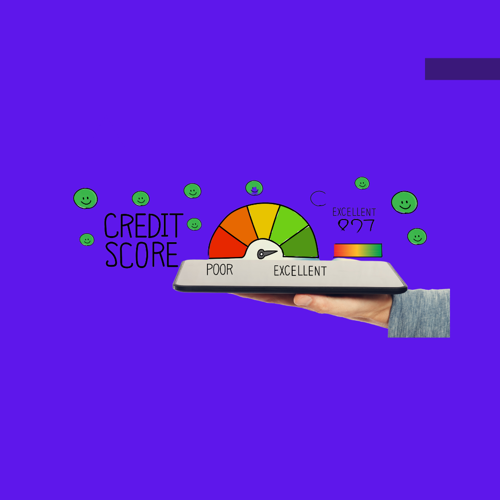

It is a financial measure to evaluate your credit history.
A credit score is a three-digit number ranging from 300-900,300 being the minimum and 900 maximum.

It is calculated on the basis of your loan,credit card history.
Lenders, such as banks and credit card companies, use your credit scores to evaluate the potential risk posed by lending money to consumers and to mitigate losses due to bad debt.

The credit score is provided by credit bureaus which are RBI licensed specialized financial institutions that collect & maintain data related to the credit behavior of both individuals and
commercial entities .In India,4 major bureaus namely CIBIL, CRIF Highmark, Equifax, and Experian provide the credit score. This data is shared with the banks/financial institutions/NBFCs who provide loans.

Financial institutions use your credit history and score as one of the factors to determine whether to lend you any money,
how much, and at what rate !

Timely payment of EMIs or credit card bills improve the credit score.

Having a higher credit score helps in:

- Quicker approval for a loan.
- Higher loan amount.
- Lesser interest rate.
- Longer repayment time.

Thus maintaining a decent credit score is always a wise decision!!
